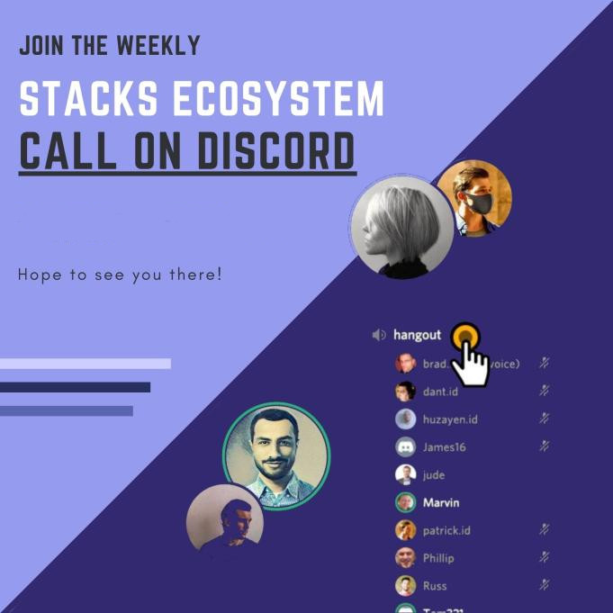
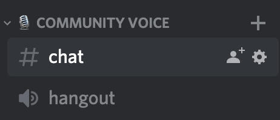

# Stacks Governance Ecosystem Calls

These ecosystem calls are a casual meeting with folks attending from across the growing Stacks Ecosystem and talking about what they are working on, what they might need help with, and of course - time for questions.

The calls happen weekly in Discord but with a rotating time of 1000 EDT / 2200 HKT one week, and 2100 EDT / 0900 HKT the next.

Drop by to connect with folks involved with Stacks, we hope to see you there!

